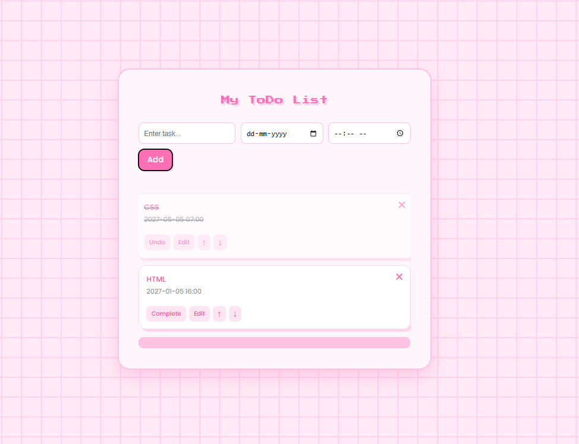

# To-Do List Web Application

## 📌 Task Information

**Repository Name:** SCT_WD_4  
**Track:** Web Development Internship  
**Task:** Build a To-Do List Web Application

---

## 🚀 Project Description

This project is a **To-Do List Web Application built using React**.  
It allows users to create and manage tasks efficiently by adding, editing, deleting, and marking tasks as completed.

Users can also set **date and time deadlines**, reorder tasks based on priority, and keep track of their daily activities through a simple and interactive interface.

The application dynamically updates tasks without reloading the page, making task management smooth and user-friendly.

---

## ✨ Features

* **Add Tasks** – Users can add new tasks to their to-do list  
* **Edit Tasks** – Modify existing tasks easily  
* **Delete Tasks** – Remove tasks from the list  
* **Mark as Completed** – Track finished tasks with a completion indicator  
* **Set Date & Time** – Assign deadlines to tasks  
* **Reorder Tasks** – Change task priority using up/down controls  
* **Dynamic Updates** – Tasks update instantly without refreshing the page  
* **Responsive Interface** – Clean and aesthetic UI design

---

## 🛠 Technologies Used

* **React.js**
* **JavaScript**
* **CSS**
* **HTML**

---

## ▶️ How to Run the Project

### 1️⃣ Clone the repository

```bash
git clone https://github.com/samridhi78B/SC_WD_4.git
```

### 2️⃣ Navigate to the project folder

```bash
cd SCT_WD_4
```

### 3️⃣ Install dependencies

```bash
npm install
```

### 4️⃣ Run the application

```bash
npm start
```

The app will run at:

```
http://localhost:3000
```

---

## 📸 Project Screenshot



---

## 📬 Author

**Samridhi**  
Web Development Intern

---

## 📄 License

This project is created for internship task submission purposes.
